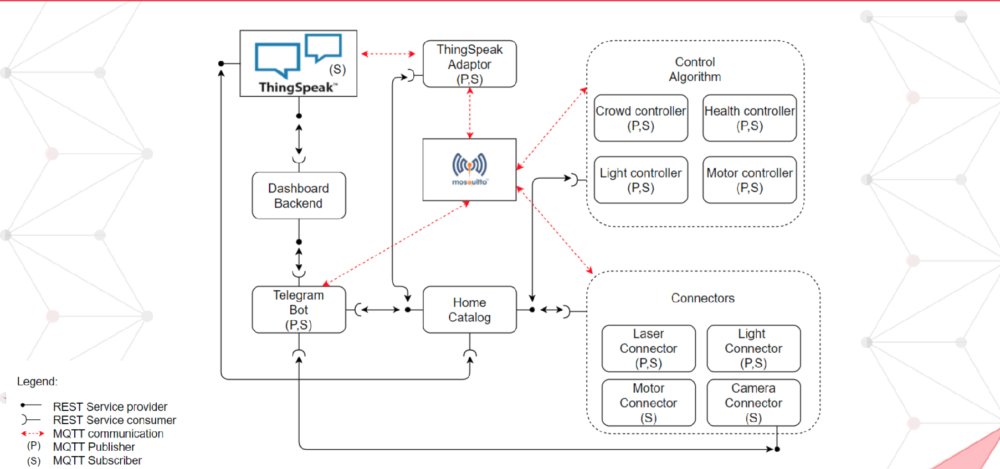
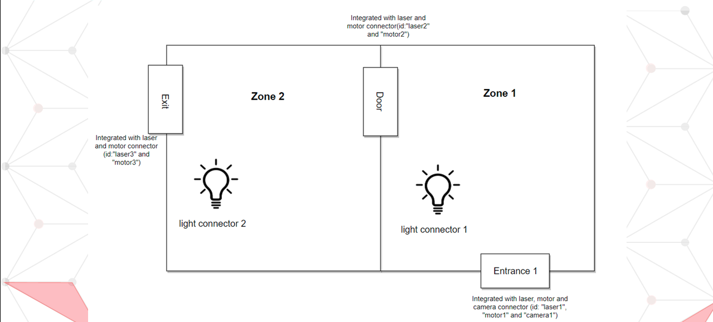

# SMART-MUSEUM-MANAGEMENT-SYSTEM
This is a student project of course "Programming for IoT applications" in Politecnico di Torino. The proposed IoT platform aims at providing services for a smart crowd management in museum.

As the figure shows, the  proposed IoT platform follows the micorservices designing pattern. Home catalog is a micro service that manage the registry of all devices and services in the system.Connectors is a set of micro services that allow simulated or real devices to connect to our platform. Control algorithm is set of micro services that analyze the sensor data and control the actuators in the system. ThingSpeak is a third party service that will help collect the system data for long term analysis. Telegram bot will be the user interface of our system. These micro services will communicate with each other with MQTT protocol or REST api.

Links:
* Promote video:
* Demo video: https://youtu.be/iSZdo9Ff_Rs
* Slide:https://drive.google.com/file/d/1-7RdZlh6kCs2okBo71eJYsPS2evNAuPa/view?usp=sharing

# Environment requirement
* System:           Ubuntu 20.04
* Python library:   opencv-python, CherryPy, pickle-mixin, paho-mqtt, requests
* Docker containers: 
```bash
# Pull docker image from docker hub with:
$ docker pull rexyyj/smms:0.1.0
# Create container with:
$ docker run -it --rm rexyyj/smms:0.1.0
# Open and updete the project with:
$ cd SMART-MUSEUM-MANAGEMENT-SYSTEM/ && git pull
```

# Run Demo
The setting of the demo is shown in the figure. Assume we have a small museum with only two zones and three doors. Each zone has a light connector. The main entrance is integrated with laser, motor and camera connector.  The  door and the exit will integrate with laser and motor connector. However, the motor connector on exit will work in “exit” mode, which only allow visitors to leave the museum.

## Step 1: Run home catalog
```bash
# Create a docker container with ip address 172.17.0.2
$ cd homeCat
$ python3 homeCat.py
# Enter the configureation(For test demo, use ip: 172.17.0.2 and port: 8090)
```

## Step 2: Run device connectors
Use the similar command below to launch the needed device connectors.
After the entire system is launched, you can use the command on screen to control the devices.
```bash
# Create a docker container and enter the project
$ cd connectors
$ python3 laserconnector.py
# Use the configureation file ./test_config/laser1.json
```
Note: 
1. For a camera connector, it should run outside docker container (current docker image is not installed with opencv).
2. For a camera connector, an Imagemanager should also be launch together.
   
## Step 4: Run control services
```bash
# Create a new docker container and enter the project
$ cd control
$ python3 crowdControl.py
# Use the configureation file ./configs/crowdControl.json

# Create a new docker container and enter the project
$ cd control
$ python3 cameraControl.py
# Use the configureation file ./configs/cameraControl.json

# Create a new docker container and enter the project
$ cd control
$ python3 motorControl.py
# Use the configureation file ./configs/motorControl.json

# Create a new docker container and enter the project
$ cd control
$ python3 lightControl.py
# Use the configureation file ./configs/lightControl.json
```

## Step 5: Run Telegram bot and dashboard backend
These two service should be launched outside docker container.
Before launch, remember to modify the ip address on the config file to the ip address of your host.
```bash
# In a new terminal
$ cd teleBot
$ python3 Telegram.py

# In a new terminal
$ cd dashboard
$ python3 Dashboard.python
```
Note: If you want to open the dashboard on a smartphone, the smart phone should be in the same sub-net with the host.